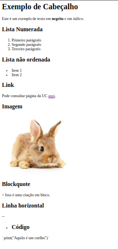

# PL2024

## Autor 

**Nome:** Luís de Castro Rodrigues Caetano

**ID:** A100893

# Descrição

O código presente em `mdhtml.py` remete a uma solução para o desafio proposto pelo professor de forma a realizar um pequeno conversor de MarkDown para HTML para os elementos descritos na "Basic Syntax" da Cheat Sheet. Isto recorrendo a expressões regulares.

## Função `mdtohtml(md)`

Esta função recebe uma string que contem texto em formato Markdown como entrada e utiliza expressões regulares para encontrar padrões específicos no texto Markdown. Estas strings são substituídas pelos equivalentes no formato HTML. 
.Os cabeçalhos em Markdown são convertidos para tags HTML de cabeçalho (`<h1>`, `<h2>` e `<h3>`.). Negrito e itálico são convertidos para `<b>` e `<i>`, respectivamente. Listas ordenadas e não ordenadas são convertidas para tags HTML `<ol>` e `<ul>`, com cada item da lista a ser convertido para `<li>`. Imagens e links Markdown são convertidos para as tags HTML `` e `<href>`, respectivamente. A linha horizontal (`---`) é convertida para `<hr>`. A blockquote (`> texto`) é convertida para `<blockquote>`. Finalmente os blocos de código (delimitados por ``` ... ```) são convertidos para `<code>`.

## Função `main()`

A função main() lê o texto Markdown do stdin, guardando o resultado na variável `md_text` e chama a função `mdtohtml(md_text)` para converter o texto Markdown em HTML de forma sequencial. Finalmente, vai escrevendo o HTML resultante num arquivo chamado `'output.html'`.

# Resultados

