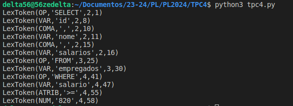

# PL2024/TPC4

## Autor

**Nome:** Luís Caetano

**ID:** A100893

## Descrição
No TPC4 da Unidade Curricular Processamento de Linguagens requeria que fosse desenvolvido um analisador léxico para uma dada query, que fosse capaz de identificar pequenas operações, neste caso as de "SELECT", "FROM" e "WHERE" e também identificar variáveis, números e atribuições.

Para este fim, inicialmente criei uma lista de tuplos, onde cada tuplo contém um tipo de token que o lexer consegue reconhecer.

De seguida defini funções que definem expressões regulares, de modo a corresponder ao respetivo token type.

Seguindo a mesma lógica, fiz o mesmo só que para casos excecionais, como por exemplo, espaços, tabs, novas linhas e erros. Para este efeito surgiram as funções `t_ignore`, `t_newline` e `t_error`.

Finalmente criei o objetico lexer, baseado nas especificações de tokens definida, criei uma frase de input e dando a frase de input ao lexer, itero os tokens identificados pelo lexer.

## Como executar
Para executar basta correr o comando: `python3 tpc4.py`.

## Resultados

